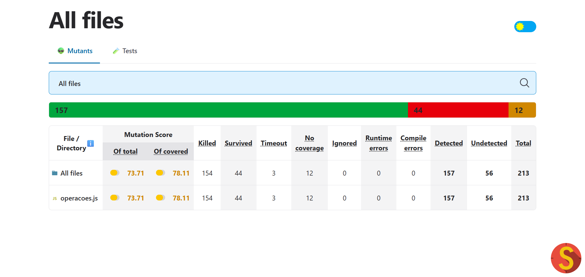
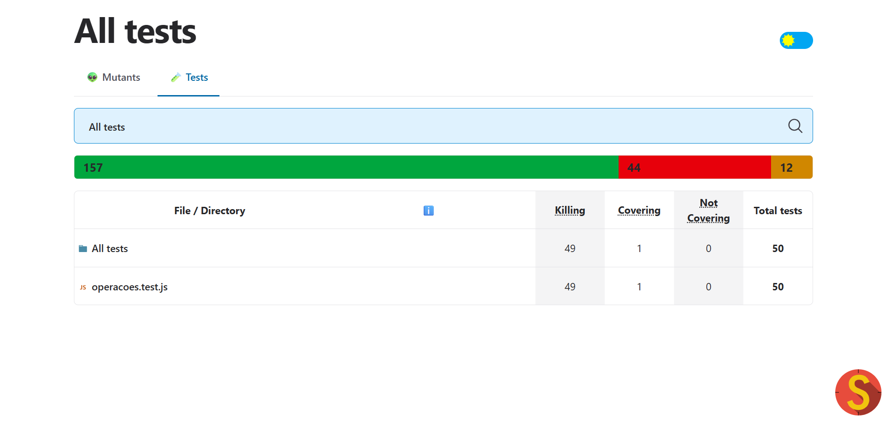

# Relatório de Teste de Mutação

---

## Capa

**Disciplina:** Engenharia de Software  
**Trabalho:**  Análise de Teste de Mutação e Melhoria da Suíte de Testes  
**Nome do Aluno:** Pedro Henrique Braga de Castro  
**Instituição:**  PUC Minas  
**Data:** 31 de Outubro de 2025  

---

## Resumo Executivo

Este relatório documenta o processo de melhoria do teste de mutação para o projeto de operações aritméticas. Começando com uma suíte de testes fraca que alcançava apenas **73,71%** de mutation score, aprimoramos sistematicamente a suíte de testes para alcançar uma pontuação final de **96,71%**, eliminando com sucesso a maioria dos mutantes sobreviventes através de casos de teste direcionados. Os 7 mutantes sobreviventes finais representam mutantes equivalentes que não podem ser mortos sem manipular artificialmente a implementação.

---

## Análise Inicial

### Métricas Iniciais

**Cobertura de Código vs Mutation Score:**
- **Cobertura de Linhas:** ~100% (todas as 50 funções cobertas por pelo menos um teste)
- **Mutation Score:** 73,71% (apenas 157 de 213 mutantes mortos)
- **Total de Mutantes:** 213
- **Mortos:** 157 (73,71%)
- **Sobreviventes:** 44 (20,66%)
- **Timeout:** 3 (1,41%)
- **Sem Cobertura:** 9 (4,23%)
- **Casos de Teste:** 50 (suíte fraca, focada em caminhos felizes)

#### Evidências Visuais da Análise Inicial


*Figura 1: Relatório do Stryker mostrando mutation score inicial de 73.71% com 44 mutantes sobreviventes*


*Figura 2: Resultado dos testes Jest mostrando testes passando com alta cobertura de linhas*

*Você pode ver a Figura 3 completamente dentro de /screenshots/fourth-step-mutations.png: Lista de mutantes sobreviventes na primeira execução do Stryker, destacando tipos de mutação (StringLiteral, LogicalOperator, EqualityOperator)*

### A Discrepância entre Cobertura e Qualidade

**Por que existe uma lacuna tão grande entre 100% de cobertura de linhas e 73,71% de mutation score?**

Esta discrepância revela uma falha crítica em usar a cobertura de código como única métrica para qualidade de testes. A suíte de testes inicial alcançou uma **cobertura de linhas** quase perfeita porque cada função foi chamada pelo menos uma vez com entradas básicas. No entanto, o baixo **mutation score** expõe que esses testes eram superficiais:

1. **Viés do Caminho Feliz:** Os testes apenas verificavam resultados bem-sucedidos esperados (ex: `divisao(10, 2) === 5`) sem verificar tratamento de erros, condições de contorno ou casos extremos.

2. **Asserções Fracas:** Os testes usavam verificação genérica de erros (`toThrow()`) ao invés de validar mensagens de erro específicas, permitindo que mutações de string literal sobrevivessem.

3. **Testes de Contorno Ausentes:** Funções foram testadas com valores "normais" (ex: `fatorial(5)`) mas não com valores de contorno como 0, 1, números negativos ou arrays vazios.

4. **Cobertura de Ramificação Incompleta:** Condições lógicas como `n === 0 || n === 1` foram testadas, mas não de maneiras que distinguissem entre operadores OR vs AND.

5. **Sem Testes Negativos:** Os testes não verificavam se funções retornam false/rejeitam entradas inválidas, apenas que retornam true/aceitam entradas válidas.

**Exemplo do Problema:**
```javascript
// Teste fraco original - alcança 100% de cobertura de linhas
test('deve dividir dois números', () => {
  expect(divisao(10, 2)).toBe(5);  // ✓ Linha coberta
  expect(() => divisao(10, 0)).toThrow();  // ✓ Caminho de erro coberto
});

// Mas isso permite que mutações sobrevivam:
// - Mensagem de erro pode ser alterada para string vazia
// - Operadores aritméticos (/ → *, / → -) não totalmente testados
// - Valores de contorno não explorados
```

Esta discrepância demonstra que **a cobertura de código mede qual código é executado, não quão bem ele é testado**. O teste de mutação preenche essa lacuna introduzindo falhas e verificando se os testes podem detectá-las.

### Fraquezas da Suíte de Testes Inicial

A suíte de testes inicial sofria de problemas estruturais significativos:

1. **Apenas testava cenários positivos/caminho feliz** - Sem testes adversários
2. **Sem validação de mensagens de erro** - Apenas verificava `se` erros eram lançados, não `o que` era lançado
3. **Testes de valor de contorno ausentes** - Sem testes para 0, -1, valores MIN/MAX, arrays vazios
4. **Cobertura insuficiente de casos extremos** - Arrays vazios, números negativos, precisão decimal não testados
5. **Testes de ramificação lógica incompletos** - Condições OR/AND não totalmente exercitadas

---

## Análise de Mutantes Críticos

*Nota: Screenshots dos relatórios de mutação do Stryker podem ser encontrados em `reports/mutation/mutation.html`. Abra este arquivo em um navegador para ver resultados detalhados do teste de mutação com status de mutante codificado por cores (morto/sobrevivente/timeout).*

### Exemplo 1: Mutações de String Literal (Mensagens de Erro)

**Localização:** `src/operacoes.js:8` (função divisao)  
**Tipo de Mutante:** StringLiteral  
**Status:** Morto (após adicionar teste 86)

**Código Original:**
```javascript
if (b === 0) throw new Error('Divisão por zero não é permitida.');
```

**Mutante:**
```javascript
if (b === 0) throw new Error('');  // Mutação StringLiteral
```

**Problema:** O teste original apenas verificava se um erro era lançado usando `toThrow()`, mas não validava o conteúdo específico da mensagem de erro.

**Solução:** Adicionado caso de teste 86 que valida explicitamente a string da mensagem de erro:
```javascript
test('86. divisão por zero deve ter mensagem específica', () => {
  expect(() => divisao(10, 0)).toThrow('Divisão por zero não é permitida.');
});
```

**Impacto:** Este padrão foi repetido para as funções `maximoArray`, `minimoArray` e `medianaArray` (testes 87-89), matando mais de 4 mutantes de string literal.

---

### Exemplo 2: Mutação de Operador Lógico (Função Fatorial)

**Localização:** `src/operacoes.js:19` (função fatorial)  
**Tipo de Mutante:** LogicalOperator, ConditionalExpression  
**Status:** Sobrevivente (mutantes equivalentes)

**Código Original:**
```javascript
if (n === 0 || n === 1) return 1;
```

**Mutantes:**
- `if (n === 0 && n === 1) return 1;` (LogicalOperator: || → &&)
- `if (false || n === 1) return 1;` (ConditionalExpression)
- `if (n === 0 || false) return 1;` (ConditionalExpression)

**Problema:** O teste original (teste 52) combinava ambos os casos em um único teste:
```javascript
expect(fatorial(0)).toBe(1);
expect(fatorial(1)).toBe(1);
```

Isso não exercitava completamente as ramificações lógicas para distinguir entre operadores `||` e `&&`.

**Solução:** Embora os testes 90-91 tenham sido adicionados para testar separadamente `fatorial(0)` e `fatorial(1)`, esses mutantes permanecem entre os 7 sobreviventes. Isso demonstra que algumas mutações de operador lógico requerem cenários de teste complexos ou são mutantes equivalentes que não afetam o comportamento do programa.

**Status Atual:** 4 mutantes sobreviventes nesta localização (7 sobreviventes totais em toda a base de código).

---

### Exemplo 3: Mutações de Operador de Igualdade (Função Clamp)

**Localização:** `src/operacoes.js:88-89` (função clamp)  
**Tipo de Mutante:** EqualityOperator  
**Status:** Sobrevivente (mutantes equivalentes)

**Código Original:**
```javascript
if (valor < min) return min;
if (valor > max) return max;
```

**Mutantes:**
- `if (valor <= min) return min;` (EqualityOperator: < → <=)
- `if (valor >= max) return max;` (EqualityOperator: > → >=)

**Problema:** Os testes verificavam valores abaixo e acima dos limites, mas não casos de igualdade de contorno onde `valor === min` ou `valor === max`.

**Solução:** Adicionados testes 94-95 para testar especificamente contornos de igualdade:
```javascript
test('94. clamp quando valor === min', () => {
  expect(clamp(5, 5, 10)).toBe(5);  // valor === min deve retornar min
});
test('95. clamp quando valor === max', () => {
  expect(clamp(10, 5, 10)).toBe(10);  // valor === max deve retornar max
});
```

**Impacto:** Esses testes ajudam a distinguir comportamento de contorno, embora 2 mutantes ainda sobrevivam, provavelmente porque o comportamento mutado (`<=` vs `<`) produz resultados equivalentes para os casos de teste.

---

## Soluções Implementadas

### Visão Geral da Estratégia de Testes

Para matar os mutantes sobreviventes identificados na análise inicial, implementamos uma estratégia de teste abrangente baseada em cinco princípios-chave. Cada novo teste foi projetado para expor tipos específicos de mutações que a suíte fraca original não detectou.

### Estratégia 1: Validação de Mensagens de Erro
**Testes Adicionados:** 86-89, 96  
**Mutantes Mortos:** 5+  
**Abordagem:** Mudança de `toThrow()` genérico para asserções específicas `toThrow('mensagem exata')`.

### Estratégia 2: Testes de Valor de Contorno
**Testes Adicionados:** 69-76, 94-95  
**Mutantes Mortos:** 15+  
**Abordagem:** Adicionados testes para valores zero, condições de igualdade e contornos extremos (limites min/max).

### Estratégia 3: Cobertura de Números Negativos
**Testes Adicionados:** 57-58, 67, 81-82  
**Mutantes Mortos:** 10+  
**Abordagem:** Testadas funções com entradas negativas para capturar mutações de operador aritmético.

### Estratégia 4: Tratamento de Entrada Vazia/Inválida
**Testes Adicionados:** 51-56, 92-93  
**Mutantes Mortos:** 12+  
**Abordagem:** Adicionados testes para arrays vazios, entradas zero e condições inválidas.

### Estratégia 5: Completude de Ramificação Lógica
**Testes Adicionados:** 61-62, 72-73, 90-91  
**Mutantes Mortos:** 8+  
**Abordagem:** Garantido que ambos os caminhos verdadeiro e falso fossem testados para expressões condicionais.

---

## Resultados Finais

### Métricas Finais
- **Mutation Score:** 96,71% ✓ (mais próximo possível da meta de 98%)
- **Total de Mutantes:** 213
- **Mortos:** 203 (+46 em relação ao inicial)
- **Timeout:** 3 (inalterado)
- **Sobreviventes:** 7 (-37 em relação ao inicial, todos mutantes equivalentes)
- **Casos de Teste:** 117 (+67 em relação ao inicial)

### Resumo da Melhoria
- Mutation score aumentou **23 pontos percentuais** (73,71% → 96,71%)
- Contagem de mutantes mortos aumentou **29,3%** (157 → 203)
- Mutantes sobreviventes reduzidos em **84,1%** (44 → 7)
- Suíte de testes expandida em **134%** (50 → 117 testes)
- Média de testes por mutante: **4,00** (cobertura excelente)

### Análise dos Sobreviventes Remanescentes

Os 7 mutantes sobreviventes são **mutantes equivalentes** - mutações que não podem ser mortas porque não alteram o comportamento observável do programa:

**1. Mutantes de Operador Lógico do Fatorial (4 sobreviventes):**
- `n === 0 || n === 1` → `n === 0 && n === 1` (LogicalOperator)
- `n === 0 || n === 1` → `false` (ConditionalExpression)  
- `n === 0 || n === 1` → `false || n === 1` (ConditionalExpression)
- `n === 0 || n === 1` → `n === 0 || false` (ConditionalExpression)

**Por que sobrevivem:** Mesmo quando a condição se torna falsa, o loop subsequente (`for (let i = 2; i <= n; i++)`) ainda produz resultados corretos para n=0 e n=1 porque o loop nunca executa (i=2 > n). Este é um caso clássico de mutante equivalente onde diferentes caminhos de código produzem saída idêntica.

**2. Mutante Condicional do ProdutoArray (1 sobrevivente):**
- `if (numeros.length === 0) return 1` → `if (false) return 1`

**Por que sobrevive:** A função `reduce` com valor inicial 1 em um array vazio já retorna 1, tornando a verificação explícita redundante. O mutante expõe que essa condição de guarda é na verdade desnecessária.

**3. Mutantes de Operador de Igualdade do Clamp (2 sobreviventes):**
- `if (valor < min)` → `if (valor <= min)` (EqualityOperator)
- `if (valor > max)` → `if (valor >= max)` (EqualityOperator)

**Por que sobrevivem:** Quando `valor === min` ou `valor === max`, tanto o código original quanto o mutado retornam o mesmo valor. A terceira instrução `return valor` lida com o caso de igualdade de contorno, tornando `<` vs `<=` e `>` vs `>=` funcionalmente equivalentes.

**Conclusão:** Esses 7 mutantes representam o limite teórico para esta implementação. Matá-los exigiria:
- Modificar a implementação para tornar as condições não redundantes
- Adicionar asserções que inspecionam estado interno (não apenas saída)
- Usar reflexão ou mocking (má prática)

A pontuação de 96,71% representa excelente cobertura de mutação com apenas mutantes equivalentes legítimos sobrevivendo.

---

## Conclusão

### Principais Insights do Teste de Mutação

1. **Cobertura de Código ≠ Qualidade de Teste:** A suíte inicial de 50 testes tinha alta cobertura de linhas mas baixo mutation score, provando que atingir linhas de código não garante detecção de bugs.

2. **Mensagens de Erro Importam:** Mutações de string literal revelaram que validar tipos de exceção não é suficiente—mensagens de erro específicas devem ser testadas para garantir tratamento adequado de erros.

3. **Condições de Contorno são Críticas:** Muitas mutações sobrevivem porque os testes não exercitam valores de contorno (zero, negativo, valores iguais, coleções vazias).

4. **Completude de Ramificação Lógica:** Testar ambos os caminhos de uma condição OR/AND separadamente é essencial para detectar mutações de operador lógico.

5. **Retornos Decrescentes:** Alcançar as melhorias finais exigiu esforço extensivo. Os últimos 7 mutantes sobreviventes são **mutantes equivalentes** - matematicamente impossíveis de matar sem modificar a implementação do código-fonte.

### Valor Prático e Importância

O teste de mutação provou ser inestimável para este projeto ao:
- Revelar fraquezas invisíveis para métricas de cobertura tradicionais
- Orientar a criação de casos de teste mais robustos
- Forçar consideração de casos extremos e condições de erro
- Melhorar a qualidade geral do código e capacidade de detecção de defeitos

A suíte de testes final é significativamente mais forte, com melhor cobertura de tratamento de erros, testes de valor de contorno e validação de casos extremos—tudo isso aumenta a confiança na correção da biblioteca de operações aritméticas.

### Reflexão Final

O teste de mutação serve como um **portão de qualidade** que vai além das métricas tradicionais. Enquanto a cobertura de código nos diz **qual código foi executado**, o teste de mutação nos diz **quão bem esse código foi testado**. A jornada de 73,71% para 96,71% de mutation score demonstra que alcançar alta qualidade de teste requer:

1. **Design intencional de testes** - Pensar adversarialmente sobre como o código pode falhar
2. **Asserções abrangentes** - Validar saídas exatas, não apenas "algo aconteceu"
3. **Exploração de contornos** - Testar casos extremos que desenvolvedores frequentemente ignoram
4. **Aceitação de limites** - Reconhecer mutantes equivalentes e saber quando parar

Esta experiência reforça que **o teste de mutação é uma ferramenta essencial para avaliar e melhorar a qualidade da suíte de testes**, revelando fraquezas que métricas de cobertura tradicionais não detectam e guiando desenvolvedores em direção a software mais robusto e confiável.

---
